# Terraform Graph

## Goal 🎯

Terraform Docs (often referred to as terraform-docs) is a tool used to automatically generate documentation for Terraform configurations. It scans Terraform module code (written in HashiCorp Configuration Language, HCL) and produces formatted documentation, typically in Markdown, that describes the module's inputs, outputs, providers, resources, and other components. This helps maintain clear, up-to-date documentation for infrastructure-as-code projects, making it easier for teams to understand and use Terraform modules.

## References 📝
- [GraphvizOnline](https://dreampuf.github.io/GraphvizOnline/)

## Create Terraform Graph Visual 🛠️

### Create digraph G with Terraform Grapgh
The terraform graph command generates a visual representation of a configuration or execution plan that you can use to generate charts.
- [terraform graph command](https://developer.hashicorp.com/terraform/cli/commands/graph)

1. Enter the following command in the terminal:

```bash
terraform graph
```
2. Copy the digraph G output.

Example Output:

```dot
digraph G {
  rankdir = "RL";
  node [shape = rect, fontname = "sans-serif"];
  "data.btp_globalaccount.this" [label="data.btp_globalaccount.this"];
  "data.btp_subaccount_environments.all" [label="data.btp_subaccount_environments.all"];
  "btp_subaccount.project_subaccount" [label="btp_subaccount.project_subaccount"];
  "btp_subaccount_environment_instance.cloudfoundry" [label="btp_subaccount_environment_instance.cloudfoundry"];
  "btp_subaccount_role_collection_assignment.emergency_administrators" [label="btp_subaccount_role_collection_assignment.emergency_administrators"];
  "random_uuid.uuid" [label="random_uuid.uuid"];
  "terraform_data.cf_landscape_label" [label="terraform_data.cf_landscape_label"];
  subgraph "cluster_module.srvc_baseline" {
    label = "module.srvc_baseline"
    fontname = "sans-serif"
    "module.srvc_baseline.data.btp_subaccount_service_plan.alert_notification_service_standard" [label="data.btp_subaccount_service_plan.alert_notification_service_standard"];
    "module.srvc_baseline.btp_subaccount_entitlement.alert_notification_service_standard" [label="btp_subaccount_entitlement.alert_notification_service_standard"];
    "module.srvc_baseline.btp_subaccount_entitlement.feature_flags_dashboard_app" [label="btp_subaccount_entitlement.feature_flags_dashboard_app"];
    "module.srvc_baseline.btp_subaccount_entitlement.feature_flags_service_lite" [label="btp_subaccount_entitlement.feature_flags_service_lite"];
    "module.srvc_baseline.btp_subaccount_service_instance.alert_notification_service_standard" [label="btp_subaccount_service_instance.alert_notification_service_standard"];
    "module.srvc_baseline.btp_subaccount_subscription.feature_flags_dashboard_app" [label="btp_subaccount_subscription.feature_flags_dashboard_app"];
  }
  "data.btp_subaccount_environments.all" -> "btp_subaccount.project_subaccount";
  "btp_subaccount.project_subaccount" -> "random_uuid.uuid";
  "btp_subaccount_environment_instance.cloudfoundry" -> "terraform_data.cf_landscape_label";
  "btp_subaccount_role_collection_assignment.emergency_administrators" -> "btp_subaccount.project_subaccount";
  "terraform_data.cf_landscape_label" -> "data.btp_subaccount_environments.all";
  "module.srvc_baseline.data.btp_subaccount_service_plan.alert_notification_service_standard" -> "module.srvc_baseline.btp_subaccount_entitlement.alert_notification_service_standard";
  "module.srvc_baseline.btp_subaccount_entitlement.alert_notification_service_standard" -> "btp_subaccount.project_subaccount";
  "module.srvc_baseline.btp_subaccount_entitlement.feature_flags_dashboard_app" -> "btp_subaccount.project_subaccount";
  "module.srvc_baseline.btp_subaccount_entitlement.feature_flags_service_lite" -> "btp_subaccount.project_subaccount";
  "module.srvc_baseline.btp_subaccount_service_instance.alert_notification_service_standard" -> "module.srvc_baseline.data.btp_subaccount_service_plan.alert_notification_service_standard";
  "module.srvc_baseline.btp_subaccount_subscription.feature_flags_dashboard_app" -> "module.srvc_baseline.btp_subaccount_entitlement.feature_flags_dashboard_app";
}
```


### Create visual based on digraph G
The graph output uses the DOT language, which is a machine-readable graph description language which originated in Graphviz. 
- [GraphvizOnline](https://dreampuf.github.io/GraphvizOnline/)
1. Paste the output in GraphvizOnline.


